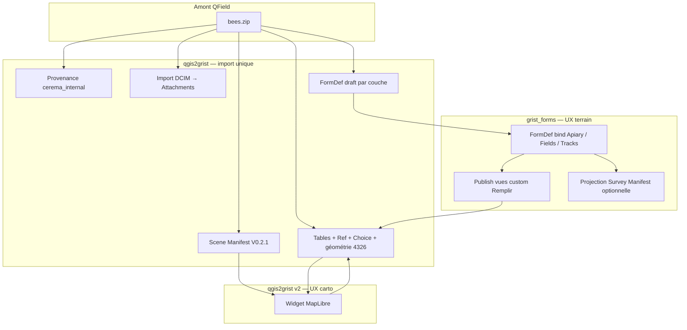

# Cas idéal — QField complet dans Grist

> **Statut** : étude architecture (2026-07-27)  
> **Référence projet** : [Bee Farming](http://qfield.org/sample-projects/bees.zip) (QField officiel)  
> **Spec offre de service** : FormDef (`grist_forms`) + Scene Manifest (`qgis2grist`) + Survey Manifest (projection)

---

## 1. Définition

**« QField complet dans Grist »** ne signifie pas reproduire l’app mobile QField.  
C’est un **document Grist autonome** qui offre la même **capacité métier** qu’un paquet QField déployé sur le terrain :

| Capacité QField | Équivalent Grist (offre de service) |
|-----------------|-------------------------------------|
| Couches + attributs + géométrie | Tables Grist (`qgis2grist` import) |
| Relations 1-N / listes de valeurs | `Ref:` / `Choice` + résolution FK |
| Formulaires par couche (onglets, champs) | **FormDef** + vue publiée (`grist_forms`) |
| Styles carto | **Scene Manifest** + widget MapLibre (`qgis2grist` v2) |
| Photos / pièces jointes | `Attachments` (FormDef phase 2 + import DCIM) |
| Provenance / classification | `meta.provenance`, `cerema_internal` |
| Gros volumes | Profils LOD A/B/C (manifest) |

**Invariant spec** : un seul contrat par domaine — pas de second moteur formulaires dans qgis2grist.

```
Scene Manifest  ↔  carto     (qgis2grist)
FormDef         ↔  formulaires (grist_forms)
Survey Manifest ↔  projection enquête (formDefToSurveyManifest)
```

---

## 2. Cas de référence — Bee Farming

Paquet analysé : `tests/fixtures/web/qfield_bees.zip` (~2 Mo).

### 2.1 Contenu du paquet

| Élément | Détail |
|---------|--------|
| Projet | `bees.qgz` |
| Données métier | `datasets/bees.gpkg` — Apiary, Fields, Tracks, tables sans géo |
| Fond carto | `basemaps/laax.gpkg` — buildings, landscape, lines (~5k entités/couche) |
| Médias | `DCIM/*.jpg` — photos liées aux champs `ExternalResource` |
| Relations QGIS | 9 relations (consommation pollen, reviews, apiary↔fields…) |

### 2.2 Couches métier vs fond

| Couche | Géom | Rôle | FormDef ? | Carte widget ? |
|--------|------|------|-----------|----------------|
| **Apiary** | Point | Entité centrale rucher | ✅ Oui (principal) | ✅ Profil A |
| **Fields** | Polygon | Parcelles / cultures | ✅ Oui | ✅ Profil A |
| **Tracks** | Line | Traces terrain | ✅ Saisie simple | ✅ Profil A |
| Pollen_Consumption | — | Table fille (%) | ✅ Via Ref parent | ❌ |
| Apiary_Reviews | — | Table fille (avis) | ✅ Via Ref / section | ❌ |
| buildings / landscape / lines | Oui | **Basemap** OSM | ❌ Lecture seule | ✅ Contexte (Profil B possible) |

**Décision idéale** : distinguer **couches métier** (formulaires + édition) et **couches contexte** (carte seule, pas de FormDef dédié).

### 2.3 Widgets QGIS observés → binding cible

| Couche Apiary / Fields | Widget QGIS | → Grist (import) | → FormDef |
|------------------------|-------------|------------------|-----------|
| bee_species | ValueMap | Choice + choices | `select` / `radio` |
| bee_amount | ValueMap | Choice | idem |
| nbr_of_boxes | Range | Int | `number` |
| picture | ExternalResource | Attachments (cible) | `file` |
| proprietor, plant_species | ValueMap | Choice | `select` |
| review_date | DateTime | DateTime | `datetime` |
| apiary_uuid | RelationReference | Ref:Apiary | `select` + cascade |

---

## 3. Architecture cible du document Grist

Après import + configuration idéale, un doc **« Bee Farming Grist »** contient :

```
Document Grist
├── Tables
│   ├── Apiary              ← qgis2grist
│   ├── Fields
│   ├── Tracks
│   ├── Pollen_Consumption
│   ├── Apiary_Reviews
│   ├── buildings           (contexte)
│   ├── landscape
│   ├── lines
│   ├── SceneManifest       ← JSON par import
│   └── Formulaires         ← grist_forms (FormDef rows)
│
├── Vues
│   ├── 🗺 Carte Bee Farming     (custom widget qgis2grist v2)
│   ├── 📝 Saisie Apiary         (custom widget grist_forms runtime)
│   ├── 📝 Saisie Fields
│   ├── 📋 Table Apiary          (Grist natif — power users)
│   └── …
│
└── QgisWidgets (config restore carte)
```

### 3.1 Diagramme flux



---

## 4. FormDef idéal — couche Apiary (exemple)

Mode **`composeMode: "bind"`** (tables déjà créées par qgis2grist).

```jsonc
{
  "manifest_version": "1.0.0",
  "id": "bee-apiary-saisie",
  "title": "Rucher — saisie terrain",
  "classification": "cerema_internal",
  "tableId": "Apiary",
  "composeMode": "bind",
  "sections": [
    {
      "id": "identite",
      "label": "Rucher",
      "fields": [
        { "colId": "beekeeper", "label": "Apiculteur", "type": "Text", "widget": "text", "required": true },
        { "colId": "nbr_of_boxes", "label": "Nombre de ruches", "type": "Int", "widget": "number" },
        { "colId": "bee_species", "label": "Espèce", "type": "Choice", "widget": "select" },
        { "colId": "bee_amount", "label": "Effectif", "type": "Choice", "widget": "select" },
        { "colId": "average_harvest", "label": "Récolte moyenne (kg)", "type": "Numeric", "widget": "number" },
        { "colId": "picture", "label": "Photo", "type": "Attachments", "widget": "file", "options": { "maxFiles": 3 } }
      ]
    },
    {
      "id": "reviews",
      "label": "Contrôles",
      "fields": [
        {
          "colId": "apiary_uuid",
          "label": "Lien rucher",
          "type": "Ref:Apiary",
          "widget": "select",
          "options": { "refTable": "Apiary", "visibleCol": "beekeeper" }
        }
      ]
    }
  ],
  "choices": {}
}
```

**Tables filles** (Pollen_Consumption, Apiary_Reviews) : FormDef séparés avec `Ref:Apiary` + cascade — équivalent des **formulaires relation** QField.

---

## 5. Scene Manifest idéal — carto

```jsonc
{
  "version": "0.2.1",
  "title": "Bee Farming",
  "classification": "cerema_internal",
  "layers": [
    { "id": "Apiary", "source": { "type": "grist", "table": "Apiary" }, "geometry_type": "point", "profile": "A", "fetch": { "mode": "full" }, "style": { "declarative": { "kind": "categorized", "field": "bee_species", "stops": [] } } },
    { "id": "Fields", "source": { "type": "grist", "table": "Fields" }, "geometry_type": "polygon", "profile": "A", "style": { "declarative": { "kind": "categorized", "field": "plant_species" } } },
    { "id": "buildings", "source": { "type": "grist", "table": "buildings" }, "geometry_type": "polygon", "profile": "B", "fetch": { "mode": "viewport" }, "visibility": { "minZoom": 14 } }
  ]
}
```

Basemap en **Profil B** (viewport) ; métier en **Profil A** (full).

---

## 6. Parcours utilisateur idéal

### Bureau (préparation)

1. Glisser `bees.zip` sur **qgis2grist v2**
2. Preview : 8 couches, badges LOD, relations détectées
3. Import → tables + SceneManifest + **FormDef brouillon** (auto-généré depuis `attributeEditorForm`)
4. Import DCIM → colonnes `Attachments` remplies
5. Ouvrir **grist_forms** → ajuster FormDef (conditions, libellés) → **Publier** vues saisie
6. Page doc : carte + onglets formulaires

### Terrain (via navigateur Grist mobile)

1. Ouvrir vue **Saisie Apiary** → formulaire guidé (grist_forms)
2. Ouvrir vue **Carte** → localiser, popup, édition attributs
3. Soumission → `AddRecord` / sync live Grist (pas offline QField)

### Analyse

1. Tables Grist natives, exports, dashboards
2. Projection **Survey Manifest** si intégration enquête / BlockNote offre de service

---

## 7. Matrice complétude — état vs cible

| # | Exigence QField complet | Responsable | État |
|---|-------------------------|-------------|------|
| 1 | Import paquet ZIP QField | qgis2grist | ✅ Testé bees.zip |
| 2 | GPKG externes + styles QML | qgis2grist | ✅ |
| 3 | Relations → Ref: | qgis2grist | ✅ |
| 4 | ValueMap → Choice | qgis2grist | ✅ |
| 5 | RelationReference → Ref | qgis2grist | ✅ (ValueRelation) |
| 6 | Scene Manifest + carte MapLibre | qgis2grist v2 | ✅ |
| 7 | LOD volumétrie | qgis2grist | ✅ V0.2.1 |
| 8 | FormDef par couche métier | grist_forms | 🟡 Manuel (bind) |
| 9 | Auto QGIS form → FormDef | **Pont à créer** | ❌ |
| 10 | ExternalResource / DCIM → Attachments | qgis2grist + grist_forms | 🟡 Code SM ; import + CORS KO |
| 11 | Formulaires relation (enfants) | grist_forms | 🟡 FormDef séparés + Ref |
| 12 | Expressions / contraintes QGIS | — | ❌ → formules Grist ou conditions FormDef |
| 13 | GPS / offline / sync QField | — | **Hors scope** (QField natif) |
| 14 | Plugins QField custom | — | **Hors scope** |
| 15 | Survey Manifest export | grist_forms | ✅ projection |
| 16 | Provenance cerema_internal | qgis2grist | ✅ |

---

## 8. Pont manquant prioritaire — `qgisFormToFormDef`

Module proposé (lib partagée ou `qgis2grist` post-import) :

```
attributeEditorForm (QGS XML)
  + fieldConfiguration (editWidget)
  + relations
        ↓
  FormDef draft (sections = onglets, fields = attributeEditorField)
        ↓
  grist_forms builder (relecture humaine + publish)
```

Mapping layout QGIS → FormDef :

| QGIS | FormDef |
|------|---------|
| `attributeEditorContainer` (tab) | `section` |
| `attributeEditorField` | `field` (colId = name) |
| `attributeEditorRelation` | section avec champs Ref + hint table enfant |
| `ValueMap` | type Choice, widget select |
| `ExternalResource` | Attachments, widget file |
| `RelationReference` | Ref + options.refTable |

**Non mappable automatiquement** : expressions `defaultValue`, `constraint`, widgets QGIS exotiques → revue manuelle ou règles documentées.

---

## 9. Roadmap recommandée

| Phase | Livrable | Projet |
|-------|----------|--------|
| **Q1** | Import bees.zip bout-en-bout dans doc Grist réel | qgis2grist |
| **Q2** | `qgisFormToFormDef` + ligne `Formulaires` par couche métier | qgis2grist → grist_forms |
| **Q3** | Import DCIM → Attachments + résolution chemins ExternalResource | qgis2grist |
| **Q4** | Wizard doc « Publier QField complet » (carte + N formulaires) | script / widget orchestrateur |
| **Q5** | Package `.grist` BigQgisMCP avec SceneManifest + Formulaires | boucle fermée |

---

## 10. Hors scope explicite (spec offre de service)

- Remplacer QFieldSync / app Android
- PostGIS / tuileur national dans le widget
- Dupliquer `scene_manifest.py` ou `survey_manifest.py` Python
- Édition géométrie mobile (trace GPS, snap, topologie) — reste QGIS/QField ou éditeur carto dédié
- Offline-first terrain sans réseau

---

## 11. Critères d’acceptation — « cas idéal validé »

Checklist sur **bees.zip** dans un doc Grist de référence :

- [ ] 5 tables métier importées avec labels et Choice corrects
- [ ] Ref Apiary ↔ Fields / Reviews / Pollen fonctionnelles dans Grist
- [ ] Photos DCIM visibles en Attachments sur Apiary et Fields
- [ ] Scene Manifest restore la carte (Apiary + Fields + basemap viewport)
- [ ] ≥ 3 vues FormDef publiées (Apiary, Fields, Tracks)
- [ ] Saisie AddRecord via formulaire sans passer par la grille
- [ ] Export Survey Manifest depuis au moins un FormDef
- [ ] Reload widget carte → restauration OK

---

*Étude alignée CADRAGE-v2, BINDING-QGIS-GRIST-CEREMA-v2, grist-forms-builder-design.*
